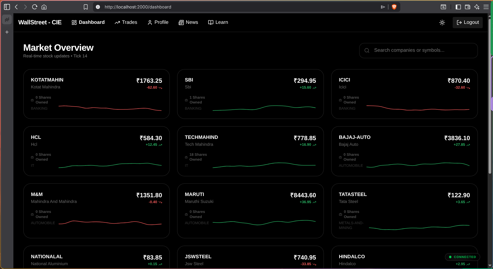
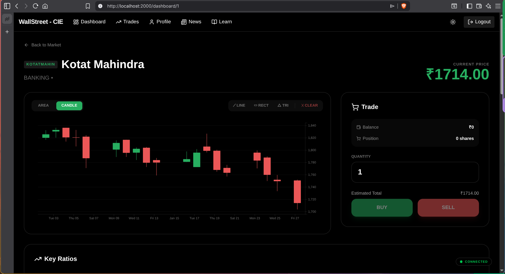
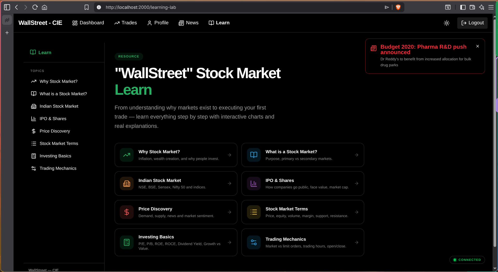
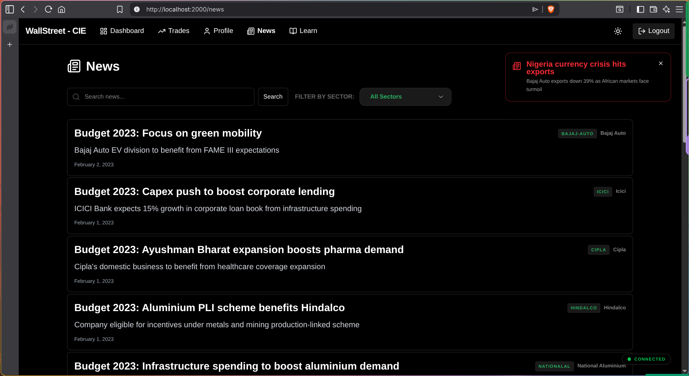
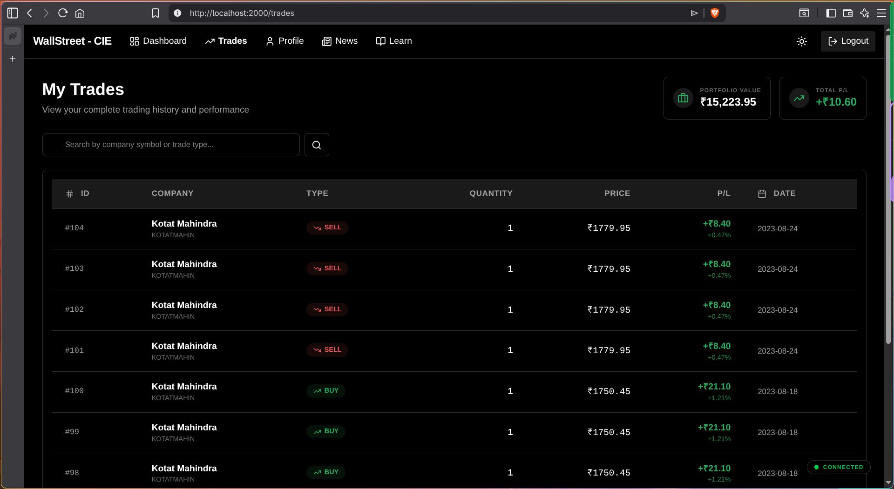
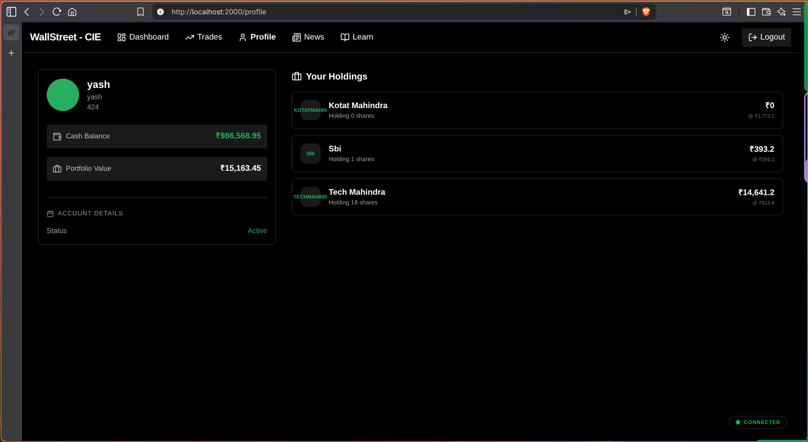
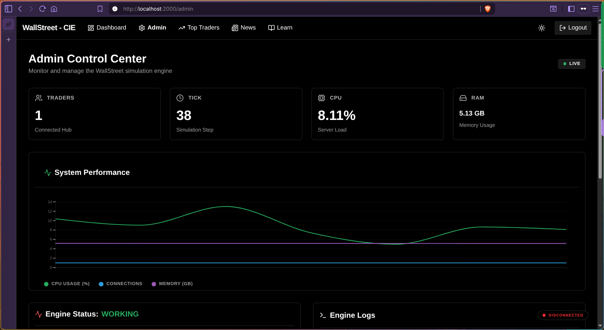
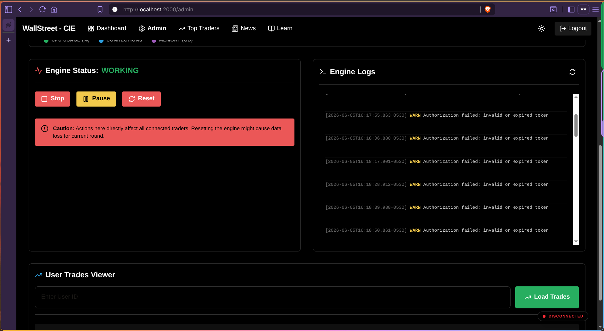

# WallStreet Simulation

## Introduction

A stock market simulation that take past years data and lets people trade using fake/vertual money. The data should be collected and stored in the backend/\_data folder and follow the instructions.

## DEMO

|           Column 1           |           Column 2           |
| :--------------------------: | :--------------------------: |
|  |  |
|  |  |
|  |  |
|  |  |

## Project Structure

This project is a monorepo consisting of:

- `backend/`: Go (Fiber) backend and simulation engine.
- `frontend/`: SvelteKit frontend with real-time updates via WebSockets.

## Getting Started

### Prerequisites

- Go 1.25.5
- Node.js 24.10.0 (or any JS runtime - i use Bun)
- PostgreSQL 18
- python

### SetUp

1. You can use the sample data already give or collect data by yourself and put it in the /backend/\_data/{company_name} folder - each folder can have fundamentals.csv, prices.csv, ratios.csv, the `backend/scripts/import_data.py` so see that.

2. Add new.csv in \_data folder

3. remember to login into your PostgreSQL server in CLI and do the below

### Database

```bash
# Create a new database
CREATE DATABASE wallstreet;

# Connect to the database
\c wallstreet;

# Run the migration

```

#### You need the following packeges installed in your python

```bash
pip install psycopg2
pip install python-dotenv
pip install pandas
```

1. Run the /backend/data/scripts/init.sql to copy paste it

2. Run the following commands to populate the database

```bash
cd backend/_data/scripts
py import_data.py
```

1. If you don't have data consider

```bash
npm scrape.mjs
```

### Backend

1. Navigate to the `backend` directory:

   ```bash
   cd backend
   ```

2. Copy the sample environment file and configure your database:

   ```bash
   cp .env.sample .env
   ```

3. Run the backend server:

   ```bash
   go run cmd/server/main.go
   ```

### Frontend

1. Navigate to the `frontend` directory:

   ```bash
   cd frontend
   ```

2. Install dependencies:

   ```bash
   npm install
   ```

3. Run the development server:

   ```bash
   npm run dev
   ```

4. Open your browser to `http://localhost:5173`.

## Features

- Fast stock price updates via WebSockets.
- Admin panel for simulation control (Start, Stop, Pause, Resume).
- Company fundamentals and performance ratios.
- Responsive dashboard with price history graphs.
- Structured logging for system monitoring.

## To run in the LAN - through wifi or ethernet

1. Get you ip adderss <ip_addr>, change the PUBLIC_HOST in ./frontend/src/lib/constants.js.

2. In dev mode launch the frontend using.

```bash
npm run dev --host
```

1. If not in dev mode the frontend will open at the ip <ip_addr>/2000, 2000 is the default port i have set. Here are your setting the PUBLIC_HOST to access the backend, so while launching in network even in dev mode set the PUBLIC_HOST

2. Now you can access the app in <ip_addr>.

3. You can change these in frontend/.env.
