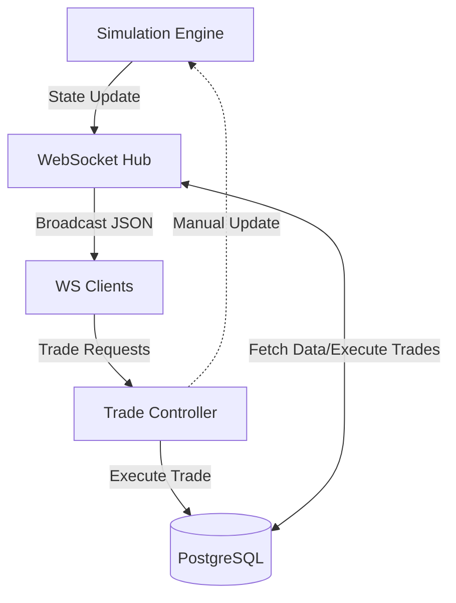

# WallStreet Backend

This is the backend for the WallStreet stock market simulation event, developed by the CIE Club - GPREC.

## System Architecture

The system is built using a reactive architecture where state changes in the simulation engine are automatically propagated to all connected clients via WebSockets.



## Key Components

### 1. Simulation Engine (`pkg/simulation/engine.go`)
The Engine is the "heartbeat" of the simulation.
- **Ticking**: It runs a continuous loop that advances the simulation time based on a configurable `tickDuration`.
- **State Management**: It maintains the authoritative simulation state (IsActive, IsPaused, CurrentDate).
- **Signals**: When a tick occurs, it broadcasts the new state to all registered subscribers via a Go channel.

### 2. Hub & Broadcast (`pkg/utils/hub.go`)
The Hub acts as a bridge between the Engine and the connected clients.
- **Subscription**: The Hub subscribes to the Engine's state update channel.
- **Data Enrichment**: On every tick, the Hub:
    1. Fetches the latest stock prices from the database for the new date.
    2. Fetches relevant news items for that day.
    3. Handles retries if the database is temporarily unavailable.
- **Broadcasting**: Once data is collected, it constructs an `UPDATE` message and broadcasts it to all active WebSocket clients.

### 3. WebSocket Handling (`pkg/controllers/trade_controller.go`)
WebSockets provide full-duplex communication between the server and the frontend.
- **Join/Leave**: Handled via the Hub's `Join` and `Leave` channels.
- **WritePump**: Each client has a dedicated goroutine to send messages sequentially, ensuring thread safety and preventing blocks.
- **Trade Execution**: Clients send trade requests (BUY/SELL) over the WebSocket. The backend validates the simulation state, checks the user's cash/portfolio in an atomic transaction, and sends back an confirmation or error message.

## Message Protocols

### Outgoing (Server -> Client)
- **UPDATE**: Contains the latest market data.
  ```json
  {
    "type": "UPDATE",
    "date": "2024-01-29T22:00:00Z",
    "stocks": [...],
    "news": [...]
  }
  ```
- **ERROR**: Reports a failed trade or system error.

### Incoming (Client -> Server)
- **Trade Request**:
  ```json
  {
    "user_id": 1,
    "company_id": 5,
    "trade_type": "BUY",
    "quantity": 10
  }
  ```

## Monitoring & Health

### Admin Dashboard
Admins can monitor the system in real-time:
- **Monitor Dashboard**: Accessible at `/api/v1/admin/monitor` (shows CPU, RAM, and request stats).
- **WebSocket Monitor**: `/api/v1/admin/monitor/ws` streams real-time system and simulation metrics.
- **Engine Logs**: `/api/v1/admin/stats/logs` returns the latest engine log entries.

## Logging

The system uses a structured logging approach with Uber's `zap` library.
- **Engine Logs**: Written to `./logs/engine.log` in JSON format.
- **Level-Based Filtering**: Console output is filtered to show only critical errors and engine-specific warnings, while the log file captures all informative events.
- **Structured Info**: Logs include timestamps, levels, categories, and contextual data (e.g., tick number, error details), allowing for structured parsing and better visibility in the admin panel.

### Health Check
- **Endpoint**: `/health` (returns `{"status": "ok"}`).

## Implementation Details

### Concurrent Safety
The system relies heavily on Go's concurrency primitives:
- **RWMutex**: Used in the Engine to allow concurrent reads of the state while ensuring exclusive writes during ticks.
- **Channels**: Used for all communication between the Engine, Hub, and Clients to avoid complex locking patterns.
- **Database Transactions**: All trades are executed in atomic transactions with `FOR UPDATE` locks to prevent double-spending or over-selling.
